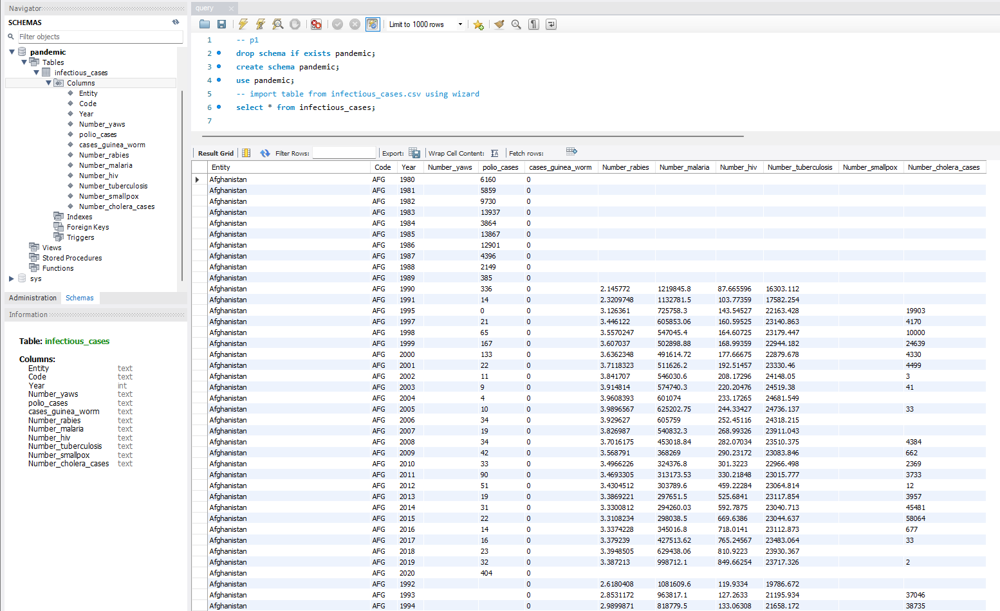
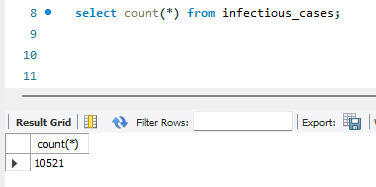
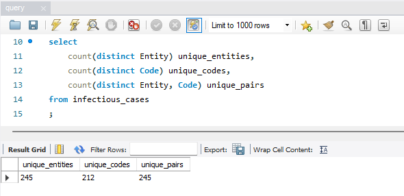
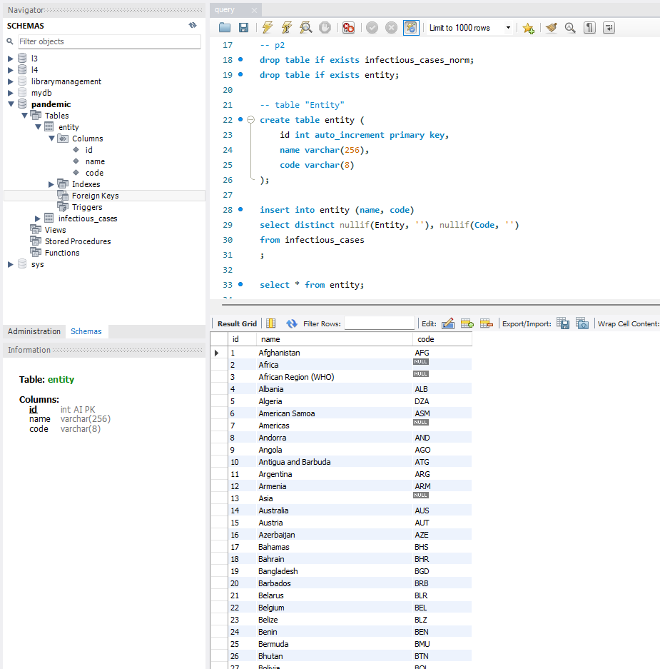
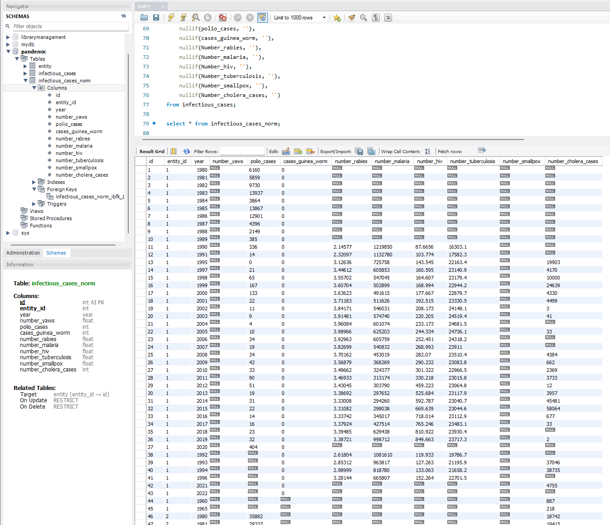
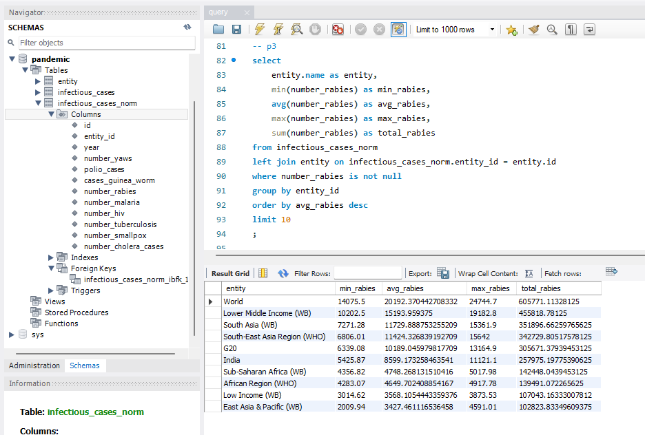
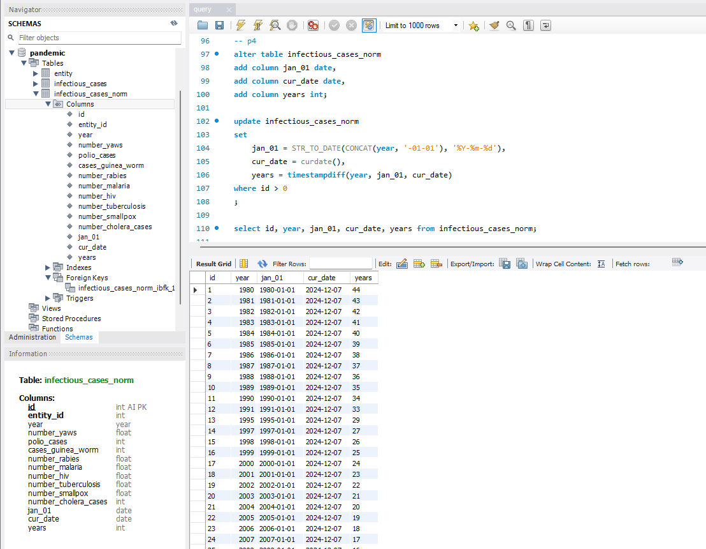
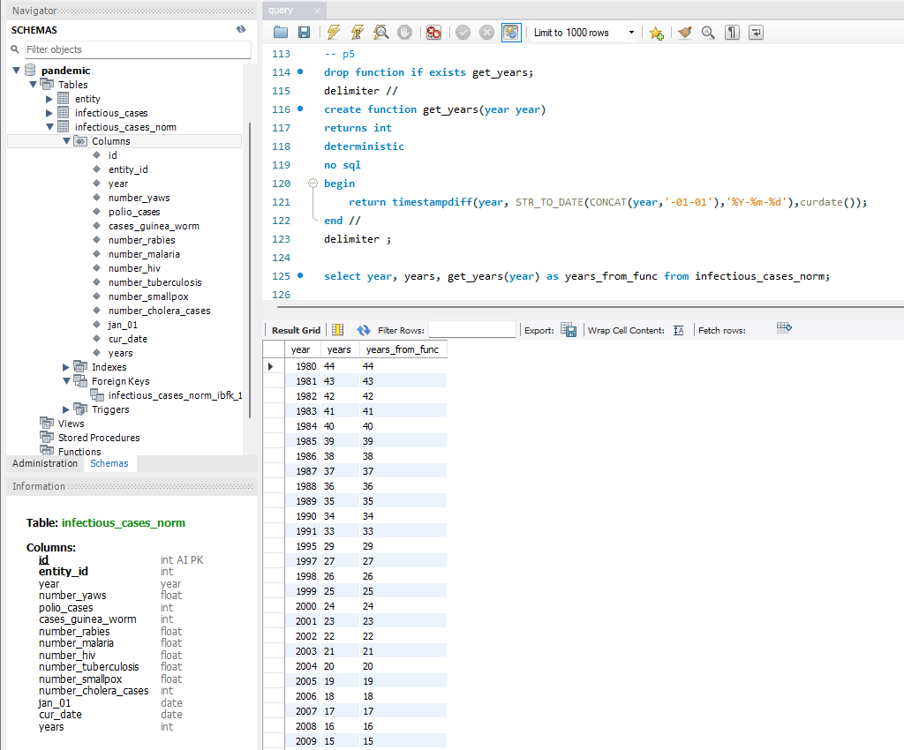

## Реляційні бази даних. Фінальний проект.

### Виконання.

#### 1. Завантажте дані
 - Створіть схему `pandemic` у базі даних за допомогою SQL-команди.
 - Оберіть її як схему за замовчуванням за допомогою SQL-команди.
 - Імпортуйте [дані](data/infectious_cases.csv) за допомогою Import wizard так, як ви вже робили це у темі 3.
 - Продивіться дані, щоб бути у контексті.

```sql
drop schema if exists pandemic;
create schema pandemic;
use pandemic;
-- import table from infectious_cases.csv using wizard
select * from infectious_cases;
```


```sql
select count(*) from infectious_cases;
```


```sql
select
    count(distinct Entity) unique_entities,
    count(distinct Code) unique_codes,
    count(distinct Entity, Code) unique_pairs
from infectious_cases
;
```



#### 2. Нормалізуйте таблицю `infectious_cases` до 3ї нормальної форми.
Збережіть у цій же схемі дві таблиці з нормалізованими даними.

```sql
drop table if exists infectious_cases_norm;
drop table if exists entity;

-- table "Entity"
create table entity (
    id int auto_increment primary key,
    name varchar(256),
    code varchar(8)
);

insert into entity (name, code)
select distinct nullif(Entity, ''), nullif(Code, '')
from infectious_cases
;

select * from entity;
```


```sql
-- table "Infectious_cases_norm"
create table infectious_cases_norm (
    id int auto_increment primary key,
    entity_id int not null,
    year year,
    number_yaws float,
    polio_cases int,
    cases_guinea_worm int,
    number_rabies float,
    number_malaria float,
    number_hiv float,
    number_tuberculosis float,
    number_smallpox float,
    number_cholera_cases int,
    foreign key (entity_id) references entity(id)
);

insert into infectious_cases_norm (
    entity_id,
    year,
    number_yaws,
    polio_cases,
    cases_guinea_worm,
    number_rabies,
    number_malaria,
    number_hiv,
    number_tuberculosis,
    number_smallpox,
    number_cholera_cases
)
select
    (select entity.id from entity where entity.name = infectious_cases.Entity),
    Year,
    nullif(Number_yaws, ''),
    nullif(polio_cases, ''),
    nullif(cases_guinea_worm, ''),
    nullif(Number_rabies, ''),
    nullif(Number_malaria, ''),
    nullif(Number_hiv, ''),
    nullif(Number_tuberculosis, ''),
    nullif(Number_smallpox, ''),
    nullif(Number_cholera_cases, '')
from infectious_cases;

select * from infectious_cases_norm;
```



#### 3. Проаналізуйте дані

 - Для кожної унікальної комбінації `Entity` та `Code` або їх `id` порахуйте середнє, мінімальне, максимальне значення та суму для атрибута `Number_rabies`.
💡 *Врахуйте, що атрибут `Number_rabies` може містити порожні значення ‘’ — вам попередньо необхідно їх відфільтрувати.*
 - Результат відсортуйте за порахованим середнім значенням у порядку спадання.
 - Оберіть тільки 10 рядків для виведення на екран.

```sql
select
    entity.name as entity,
    min(number_rabies) as min_rabies,
    avg(number_rabies) as avg_rabies,
    max(number_rabies) as max_rabies,
    sum(number_rabies) as total_rabies
from infectious_cases_norm
left join entity on infectious_cases_norm.entity_id = entity.id
where number_rabies is not null
group by entity_id
order by avg_rabies desc
limit 10
;
```


#### 4. Побудуйте колонку різниці в роках.

Для оригінальної або нормованої таблиці для колонки `Year` побудуйте з використанням вбудованих SQL-функцій:
 - атрибут, що створює дату першого січня відповідного року,
💡 *Наприклад, якщо атрибут містить значення ’1996’, то значення нового атрибута має бути ‘1996-01-01’.*
 - атрибут, що дорівнює поточній даті,
 - атрибут, що дорівнює різниці в роках двох вищезгаданих колонок.
💡 *Перераховувати всі інші атрибути, такі як `Number_malaria`, не потрібно.*
```sql
alter table infectious_cases_norm
add column jan_01 date,
add column cur_date date,
add column years int
;

update infectious_cases_norm
set
    jan_01 = STR_TO_DATE(CONCAT(year, '-01-01'), '%Y-%m-%d'),
    cur_date = curdate(),
    years = timestampdiff(year, jan_01, cur_date)
where id > 0
;

select id, year, jan_01, cur_date, years from infectious_cases_norm;
```


#### 5. Побудуйте власну функцію.
 - Створіть і використайте функцію, що будує такий же атрибут, як і в попередньому завданні: функція має приймати на вхід значення року, а повертати різницю в роках між поточною датою та датою, створеною з атрибута року (1996 рік → ‘1996-01-01’).

```sql
drop function if exists get_years;
delimiter //
create function get_years(year year)
returns int
deterministic
no sql
begin
    return timestampdiff(year, STR_TO_DATE(CONCAT(year,'-01-01'),'%Y-%m-%d'),curdate());
end //
delimiter ;

select year, years, get_years(year) as years_from_func from infectious_cases_norm;
```

